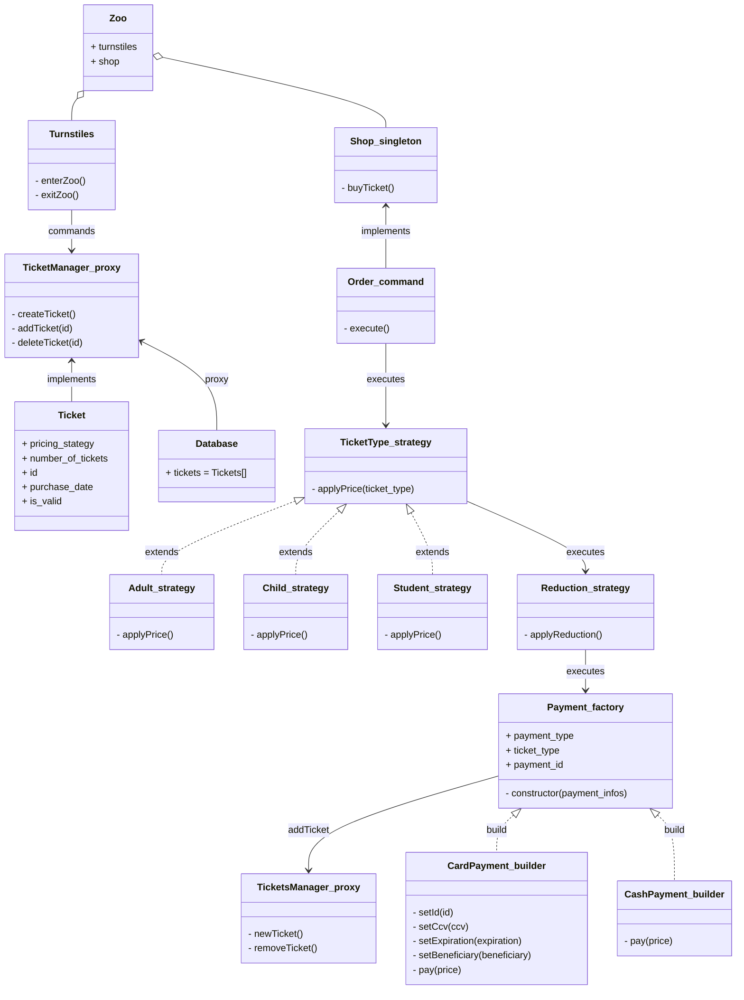

# Global schema

```mermaid

classDiagram

	class Zoo {
		+ turnstiles
		+ shop
	}

	class Turnstiles {
		- enterZoo()
		- exitZoo()
	}

	class TicketManager_proxy {
		- createTicket()
		- addTicket(id)
		- deleteTicket(id)
	}

	class Ticket {
		+ pricing_stategy
		+ number_of_tickets
		+ id
		+ purchase_date
		+ is_valid
	}

	class Database {
		+ tickets = Tickets[]
	}

	class Shop_singleton {
		- buyTicket()	
	}

	class Order_command {
		- execute()
	}

	class Payment_factory {
		+ payment_type
		+ ticket_type
		+ payment_id
		- constructor(payment_infos)
	}

	class CardPayment_builder {
		
		- setId(id)
		- setCcv(ccv)
		- setExpiration(expiration)	
		- setBeneficiary(beneficiary)
		- pay(price)
	}
	class CashPayment_builder {
		- pay(price)
	}

	class TicketType_strategy {
		- applyPrice(ticket_type)	
	}
	class Adult_strategy {
		- applyPrice()
	}
	class Child_strategy {
		- applyPrice()
	}
	class Student_strategy {
		- applyPrice()
	}

	class Reduction_strategy {
		- applyReduction()
	}

	class TicketsManager_proxy {
		- newTicket()
		- removeTicket()
	}

	Zoo o-- Shop_singleton 
	Zoo o-- Turnstiles
	Turnstiles --> TicketManager_proxy : commands
	Shop_singleton <-- Order_command : implements
	Order_command --> TicketType_strategy : executes
	TicketType_strategy --> Reduction_strategy : executes
	TicketType_strategy <|.. Adult_strategy : extends
	TicketType_strategy <|.. Child_strategy : extends
	TicketType_strategy <|.. Student_strategy : extends
	Reduction_strategy --> Payment_factory : executes
	Payment_factory --> TicketsManager_proxy : addTicket
	Payment_factory <|.. CardPayment_builder : build
	Payment_factory <|.. CashPayment_builder : build
	TicketManager_proxy <-- Database : proxy
	TicketManager_proxy <-- Ticket : implements
	
```
